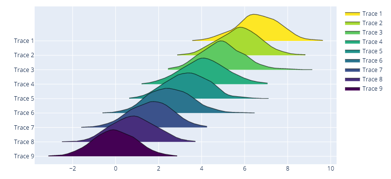
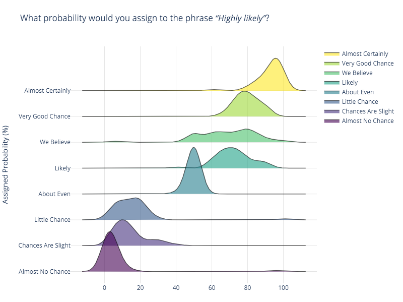

<p align="center">
    
</p>

<h1 id="ridgeplot" align="center">
    ridgeplot: beautiful ridgeline plots in Python
</h1>

<p align="center">
  <!-- TODO: https://bestpractices.coreinfrastructure.org/en -->
  <!-- TODO: https://www.gitpod.io/docs/getting-started -->
  <a href="https://pypi.org/project/ridgeplot/"></a>
  <a href="https://github.com/tpvasconcelos/ridgeplot/"></a>
  <a href="https://pypi.org/project/ridgeplot/"></a>
  <a href="https://github.com/tpvasconcelos/ridgeplot/blob/master/LICENSE"></a>
  <a href="https://github.com/psf/black"></a>
  <br>
  <a href="https://github.com/tpvasconcelos/ridgeplot/actions/workflows/ci.yaml/"></a>
  <a href="https://codecov.io/gh/tpvasconcelos/ridgeplot"></a>
  <a href="https://www.codefactor.io/repository/github/tpvasconcelos/ridgeplot"></a>
  <a href="https://www.codacy.com/gh/tpvasconcelos/ridgeplot/dashboard?utm_source=github.com&amp;utm_medium=referral&amp;utm_content=tpvasconcelos/ridgeplot&amp;utm_campaign=Badge_Grade"></a>
  <a href="https://requires.io/github/tpvasconcelos/ridgeplot/requirements/?branch=master"></a>
</p>


<!-- <p align="center"><i>Beautiful ridgeline plots in python</i></p> -->

---

The `ridgeplot` python library aims at providing a simple API for plotting beautiful
[ridgeline plots](https://www.data-to-viz.com/graph/ridgeline.html) within the extensive
[Plotly](https://plotly.com/python/) interactive graphing environment.

Bumper stickers:

- Do one thing, and do it well!
- Use sensible defaults, but allow for extensive configuration!

## How to get it?

The source code is currently hosted on GitHub at: <https://github.com/tpvasconcelos/ridgeplot>

Install and update using [pip](https://pip.pypa.io/en/stable/quickstart/):

```shell
pip install -U ridgeplot
```

### Dependencies

- [plotly](https://plotly.com/) - the interactive graphing backend that powers `ridgeplot`
- [statsmodels](https://www.statsmodels.org/) - Used for Kernel Density Estimation (KDE)
- [numpy](https://numpy.org/) - Supporting library for multi-dimensional array manipulations

## How to use it?

### Sensible defaults

```python
from numpy.random import normal
from ridgeplot import ridgeplot

synthetic_samples = [normal(n / 1.2, size=600) for n in reversed(range(9))]
fig = ridgeplot(samples=synthetic_samples)
fig.show()
```



### Fully configurable

In this example, we will be replicating the first ridgeline plot example in
[this _from Data to Viz_ post](https://www.data-to-viz.com/graph/ridgeline.html), which uses the
_probly_ dataset. You can find the _plobly_ dataset on multiple sources like in the
[bokeh](https://raw.githubusercontent.com/bokeh/bokeh/main/bokeh/sampledata/_data/probly.csv)
python interactive visualization library. I'll be using the
[same source](https://raw.githubusercontent.com/zonination/perceptions/master/probly.csv) used in
the original post.

```python
import numpy as np
import pandas as pd
from ridgeplot import ridgeplot


# Get the raw data
df = pd.read_csv("https://raw.githubusercontent.com/bokeh/bokeh/main/bokeh/sampledata/_data/probly.csv")

# Let's grab only the subset of columns displayed in the example
column_names = [
    "Almost Certainly", "Very Good Chance", "We Believe", "Likely",
    "About Even", "Little Chance", "Chances Are Slight", "Almost No Chance",
]
df = df[column_names]

# Not only does 'ridgeplot(...)' come configured with sensible defaults
# but is also fully configurable to your own style and preference!
fig = ridgeplot(
    samples=df.values.T,
    bandwidth=4,
    kde_points=np.linspace(-12.5, 112.5, 400),
    colorscale="viridis",
    colormode="index",
    coloralpha=0.6,
    labels=column_names,
    spacing=5 / 9,
)

# Again, update the figure layout to your liking here
fig.update_layout(
    title="What probability would you assign to the phrase <i>“Highly likely”</i>?",
    height=650,
    width=800,
    plot_bgcolor="rgba(255, 255, 255, 0.0)",
    xaxis_gridcolor="rgba(0, 0, 0, 0.1)",
    yaxis_gridcolor="rgba(0, 0, 0, 0.1)",
    yaxis_title="Assigned Probability (%)",
)
fig.show()
```



## Alternatives

- [`plotly` - from examples/galery](https://plotly.com/python/violin/#ridgeline-plot)
- [`seaborn` - from examples/galery](https://seaborn.pydata.org/examples/kde_ridgeplot)
- [`bokeh` - from examples/galery](https://docs.bokeh.org/en/latest/docs/gallery/ridgeplot.html)
- [`matplotlib` - from blogpost](https://matplotlib.org/matplotblog/posts/create-ridgeplots-in-matplotlib/)
- [`joypy` - Ridgeplot library using a `matplotlib` backend](https://github.com/sbebo/joypy)
