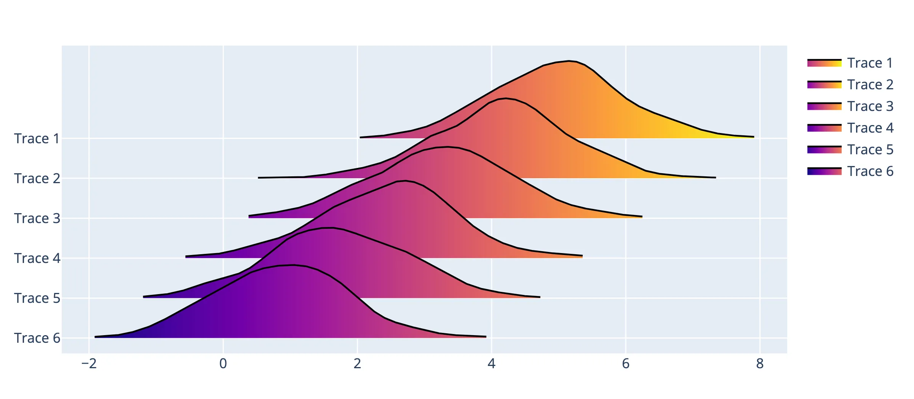
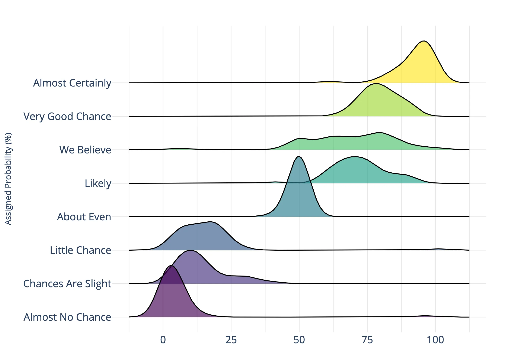
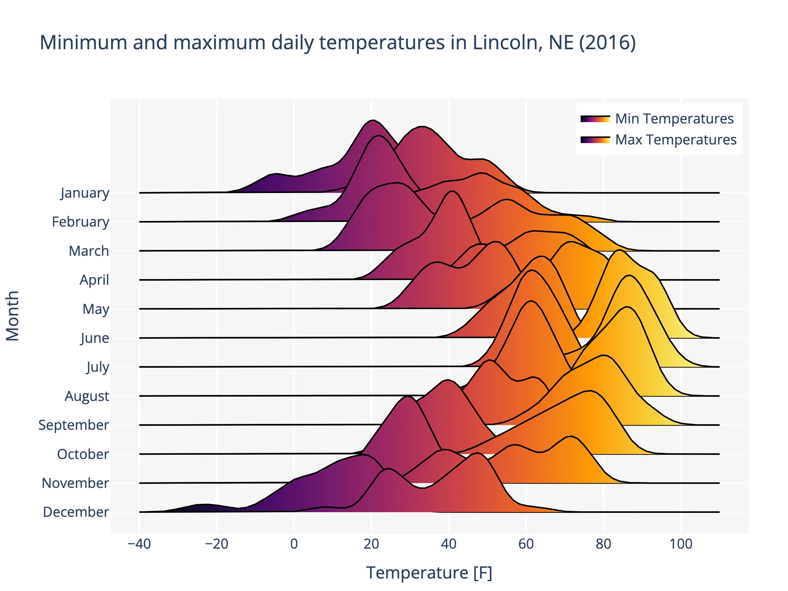

<p align="center">
    
</p>

<h1 id="ridgeplot" align="center">
    ridgeplot: beautiful ridgeline plots in Python
</h1>

<p align="center">
  <!-- TODO: https://bestpractices.coreinfrastructure.org/en -->
  <!-- TODO: https://www.gitpod.io/docs/getting-started -->
  <a href="https://pypi.org/project/ridgeplot/"></a>
  <a href="https://github.com/tpvasconcelos/ridgeplot/"></a>
  <a href="https://pepy.tech/project/ridgeplot"></a>
  <a href="https://pypi.org/project/ridgeplot/"></a>
  <a href="https://github.com/tpvasconcelos/ridgeplot/blob/main/LICENSE"></a>
  <br>
  <a href="https://github.com/tpvasconcelos/ridgeplot/actions/workflows/ci.yml/"></a>
  <a href="https://github.com/tpvasconcelos/ridgeplot/actions/workflows/codeql.yml/"></a>
  <a href="https://ridgeplot.readthedocs.io/en/latest/"></a>
  <a href="https://codecov.io/gh/tpvasconcelos/ridgeplot"></a>
  <a href="https://www.codefactor.io/repository/github/tpvasconcelos/ridgeplot"></a>
  <a href="https://app.codacy.com/gh/tpvasconcelos/ridgeplot/dashboard?utm_source=gh&utm_medium=referral&utm_content=&utm_campaign=Badge_grade"></a>
</p>

-----------------

`ridgeplot` is a Python package that provides a simple interface for plotting beautiful and interactive [ridgeline plots](https://ridgeplot.readthedocs.io/en/stable/getting_started/getting_started.html) within the extensive [Plotly](https://plotly.com/python/) ecosystem.

## Installation

`ridgeplot` can be installed and updated from [PyPi](https://pypi.org/project/ridgeplot/) using [pip](https://pip.pypa.io/en/stable/quickstart/):

```shell
pip install -U ridgeplot
```

For more information, see the [installation guide](https://ridgeplot.readthedocs.io/en/stable/getting_started/installation.html).

## Getting started

Take a look at the [getting started guide](https://ridgeplot.readthedocs.io/en/stable/getting_started/getting_started.html), which provides a quick introduction to the `ridgeplot` library.

The full official documentation can be found at: https://ridgeplot.readthedocs.io/en/stable/

### Basic example

For those in a hurry, here's a very basic example on how to quickly get started with [ridgeplot()](https://ridgeplot.readthedocs.io/en/stable/api/public/ridgeplot.ridgeplot.html) function.

```python
import numpy as np
from ridgeplot import ridgeplot

my_samples = [np.random.normal(n / 1.2, size=600) for n in range(8, 0, -1)]
fig = ridgeplot(samples=my_samples)
fig.update_layout(height=450, width=800)
fig.show()
```



### Flexible configuration

In this example, we will try to replicate the first ridgeline plot in this [_from Data to Viz_ post](https://www.data-to-viz.com/graph/ridgeline.html). The example in the post was created using the [_"Perception of Probability Words"_ dataset](https://ridgeplot.readthedocs.io/en/stable/api/public/ridgeplot.datasets.load_probly.html) and the popular [ggridges](https://wilkelab.org/ggridges/) R package. In the end, we will see how the `ridgeplot` Python library can be used to create a (nearly) identical plot, thanks to its extensive configuration options.

```python
import numpy as np
from ridgeplot import ridgeplot
from ridgeplot.datasets import load_probly

# Load the probly dataset
df = load_probly()

# Let's grab the subset of columns used in the example
column_names = [
    "Almost Certainly",
    "Very Good Chance",
    "We Believe",
    "Likely",
    "About Even",
    "Little Chance",
    "Chances Are Slight",
    "Almost No Chance",
]
df = df[column_names]

# Not only does 'ridgeplot(...)' come configured with sensible defaults
# but is also fully configurable to your own style and preference!
fig = ridgeplot(
    samples=df.to_numpy().T,
    bandwidth=4,
    kde_points=np.linspace(-12.5, 112.5, 500),
    colorscale="viridis",
    colormode="row-index",
    coloralpha=0.65,
    labels=column_names,
    linewidth=2,
    spacing=5 / 9,
)

# And you can still update and extend the final
# Plotly Figure using standard Plotly methods
fig.update_layout(
    height=760,
    width=900,
    font_size=16,
    plot_bgcolor="white",
    xaxis_tickvals=[-12.5, 0, 12.5, 25, 37.5, 50, 62.5, 75, 87.5, 100, 112.5],
    xaxis_ticktext=["", "0", "", "25", "", "50", "", "75", "", "100", ""],
    xaxis_gridcolor="rgba(0, 0, 0, 0.1)",
    yaxis_gridcolor="rgba(0, 0, 0, 0.1)",
    yaxis_title="Assigned Probability (%)",
    showlegend=False,
)

# Show us the work!
fig.show()
```



### More examples

For more examples, take a look at the [getting started guide](https://ridgeplot.readthedocs.io/en/stable/getting_started/getting_started.html). For instance, this example demonstrates how you can also draw [multiple traces](https://ridgeplot.readthedocs.io/en/stable/getting_started/getting_started.html#more-traces) per row in your ridgeline plot:

```python
import numpy as np
from ridgeplot import ridgeplot
from ridgeplot.datasets import load_lincoln_weather

# Load test data
df = load_lincoln_weather()

# Transform the data into a 3D (ragged) array format of
# daily min and max temperature samples per month
months = df.index.month_name().unique()
samples = [
    [
        df[df.index.month_name() == month]["Min Temperature [F]"],
        df[df.index.month_name() == month]["Max Temperature [F]"],
    ]
    for month in months
]

# And finish by styling it up to your liking!
fig = ridgeplot(
    samples=samples,
    labels=months,
    coloralpha=0.98,
    bandwidth=4,
    kde_points=np.linspace(-25, 110, 400),
    spacing=0.33,
    linewidth=2,
)
fig.update_layout(
    title="Minimum and maximum daily temperatures in Lincoln, NE (2016)",
    height=650,
    width=950,
    font_size=14,
    plot_bgcolor="rgb(245, 245, 245)",
    xaxis_gridcolor="white",
    yaxis_gridcolor="white",
    xaxis_gridwidth=2,
    yaxis_title="Month",
    xaxis_title="Temperature [F]",
    showlegend=False,
)
fig.show()
```


