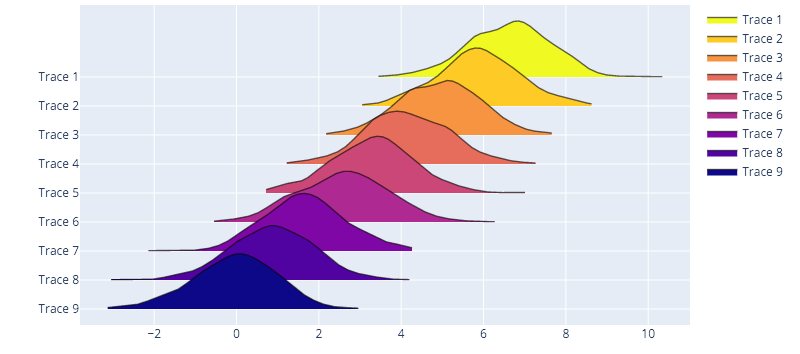
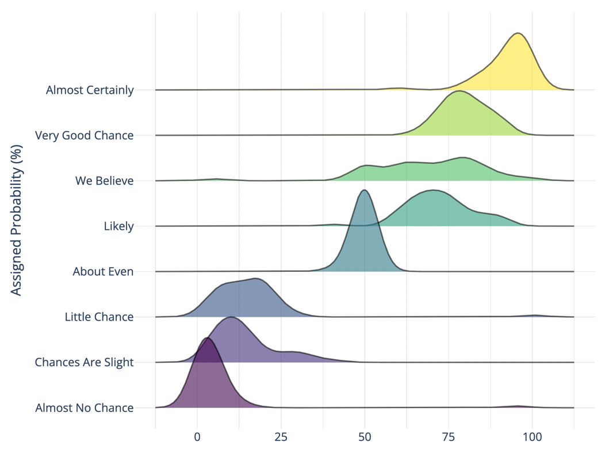

# Getting started

## Sensible defaults

Get started with a simple function call to {py:func}`~ridgeplot.ridgeplot()` with sensible (plotly)
defaults.

```python
import numpy as np

from ridgeplot import ridgeplot

# Put your real samples here...
np.random.seed(0)
synthetic_samples = [np.random.normal(n / 1.2, size=600) for n in range(9, 0, -1)]

# Call the `ridgeplot()` helper, packed with sensible defaults
fig = ridgeplot(samples=synthetic_samples)

# The returned Plotly `Figure` is still fully customizable
fig.update_layout(height=500, width=800)

# show us the work!
fig.show()
```



## Fully configurable

In this example, we will be replicating the first ridgeline plot example in
[this _from Data to Viz_ post](https://www.data-to-viz.com/graph/ridgeline.html), which uses the
_probly_ dataset. You can find the _plobly_ dataset on multiple sources like in the
[bokeh](https://raw.githubusercontent.com/bokeh/bokeh/main/bokeh/sampledata/_data/probly.csv) python
interactive visualization library. I'll be using the
[same source](https://raw.githubusercontent.com/zonination/perceptions/master/probly.csv) used in
the original post.

```python
import numpy as np
from ridgeplot import ridgeplot
from ridgeplot.datasets import load_probly

# Load the probly dataset
df = load_probly()

# Let's grab only the subset of columns displayed in the example
column_names = [
    "Almost Certainly", "Very Good Chance", "We Believe", "Likely",
    "About Even", "Little Chance", "Chances Are Slight", "Almost No Chance",
]  # fmt: skip
df = df[column_names]

# Not only does 'ridgeplot(...)' come configured with sensible defaults
# but is also fully configurable to your own style and preference!
fig = ridgeplot(
    samples=df.values.T,
    bandwidth=4,
    kde_points=np.linspace(-12.5, 112.5, 400),
    colorscale="viridis",
    colormode="index",
    coloralpha=0.6,
    labels=column_names,
    spacing=5 / 9,
)

# Again, update the figure layout to your liking here
fig.update_layout(
    title="What probability would you assign to the phrase <i>“Highly likely”</i>?",
    height=650,
    width=800,
    plot_bgcolor="rgba(255, 255, 255, 0.0)",
    xaxis_gridcolor="rgba(0, 0, 0, 0.1)",
    yaxis_gridcolor="rgba(0, 0, 0, 0.1)",
    yaxis_title="Assigned Probability (%)",
)
fig.show()
```


