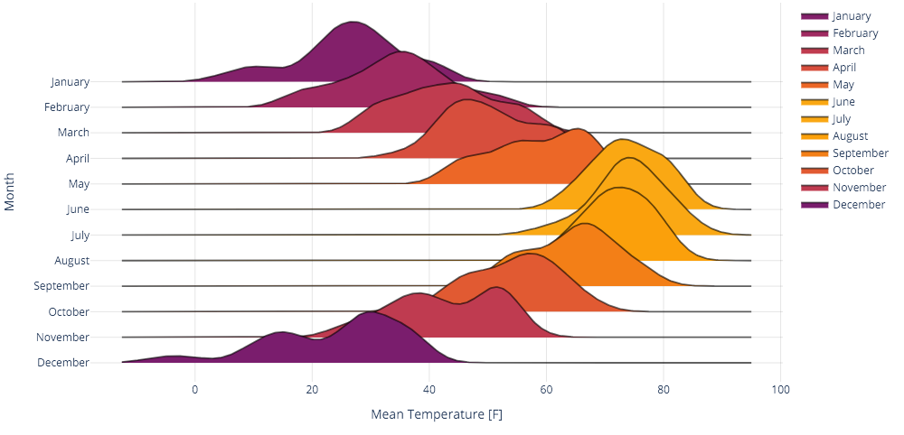

<h1 id="ridgeplot" align="center">
  ridgeplot: beautiful ridgeline plots in Python
</h1>

<p align="center">
  <!-- TODO: https://bestpractices.coreinfrastructure.org/en -->
  <!-- TODO: https://www.gitpod.io/docs/getting-started -->
  <a href="https://pypi.org/project/ridgeplot/"></a>
  <a href="https://github.com/tpvasconcelos/ridgeplot/"></a>
  <a href="https://pypi.org/project/ridgeplot/"></a>
  <a href="https://github.com/tpvasconcelos/ridgeplot/blob/main/LICENSE"></a>
  <br>
  <a href="https://github.com/tpvasconcelos/ridgeplot/actions/workflows/ci.yaml/"></a>
  <a href="https://ridgeplot.readthedocs.io/en/latest/"></a>
  <a href="https://codecov.io/gh/tpvasconcelos/ridgeplot"></a>
  <a href="https://www.codefactor.io/repository/github/tpvasconcelos/ridgeplot"></a>
  <a href="https://www.codacy.com/gh/tpvasconcelos/ridgeplot/dashboard?utm_source=github.com&amp;utm_medium=referral&amp;utm_content=tpvasconcelos/ridgeplot&amp;utm_campaign=Badge_Grade"></a>
</p>

______________________________________________________________________

The `ridgeplot` python library aims at providing a simple API for plotting beautiful
[ridgeline plots](https://www.data-to-viz.com/graph/ridgeline.html) within the extensive
[Plotly](https://plotly.com/python/) interactive graphing environment.

Bumper stickers:

- Do one thing, and do it well!
- Use sensible defaults, but allow for extensive configuration!

<p align="center">
  
</p>

```{toctree}
---
caption: Getting started
maxdepth: 1
---
installation
getting_started
```

```{toctree}
---
caption: Reference
maxdepth: 1
---
reference/api
reference/changelog
reference/alternatives
```

```{toctree}
---
caption: Development
maxdepth: 1
---
development/contributing
```
